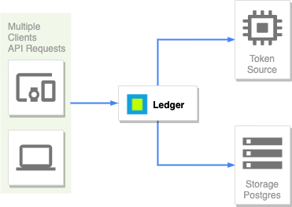

# Ledger

**Note**: The `master` branch may be in an *unstable or even broken state* during development. Please use [releases][github-release] 
instead of the `master` branch in order to get stable binaries.



Ledger is a service used to generate one or multiple string tokens. These tokens are 22 characters long and limited to 
455,902 per request.    

The service is written in Go and integrates with an external service (Source) to generate string tokens. It stores all 
valid issued tokens to a storage (PostgreSQL) enforcing uniqueness and validation, like _no-dash_ characters.

## Getting started

### Quick start

```sh
# Clone repository
$ git clone https://github.com/danielnegri/adheretech.git
$ cd adheretech

# Make sure to edit the database address, username, password, and token URL parameters.
$ cp .env.sample .env
$ vim .env

# Build & run
$ docker-compose up -d
$ curl -s -XPOST http://localhost:8080/api/v1/tokens?size=1
OK : ijkr2lXOkM1EElPSDQFkeg
```

### Getting Ledger

The easiest way to get Ledger is to use one the pre-built release binaries which are available for OSX and Linux.

For those wanting to try the very latest version, [build the latest version of Ledger][dl-build] from the `master` branch. 
This first needs [*Go*](https://golang.org/) installed (version 1.13+ is required). All development occurs on `master`, 
including new features and bug fixes. Bug fixes are first targeted at `master` and subsequently ported to release branches, 
as described in the [branch management][branch-management] guide.

[github-release]: https://github.com/danielnegri/adheretech/releases
[branch-management]: ./docs/branch-management.md
[dl-build]: ./docs/dl-build.md#build-the-latest-version


## Contributing

See [CONTRIBUTING](CONTRIBUTING.md) for details on submitting patches and the contribution workflow.

### License

Ledger is under the AGPL 3.0 license. See the [LICENSE](LICENSE) file for details.
